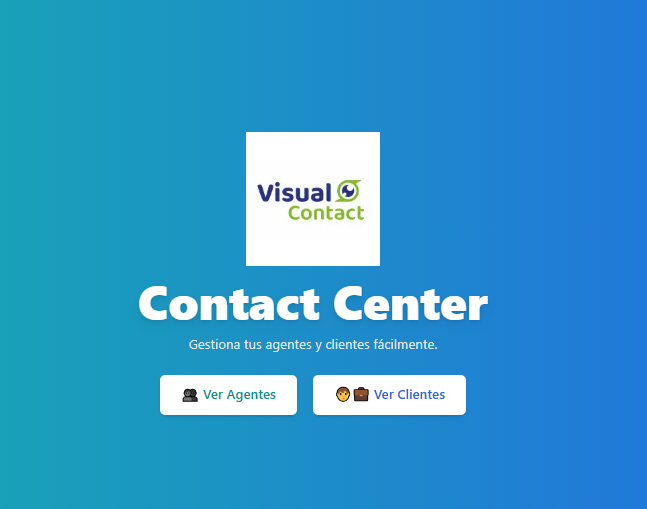
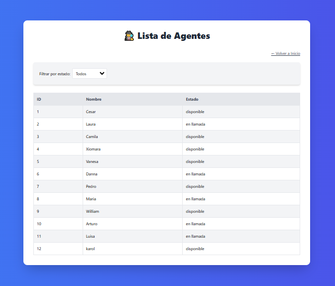
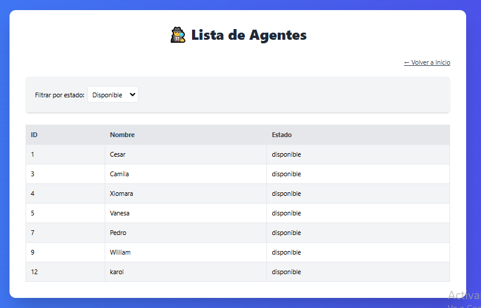
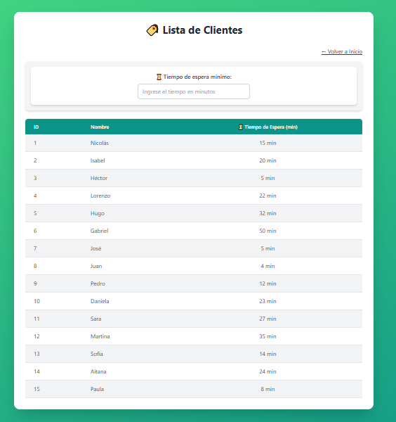
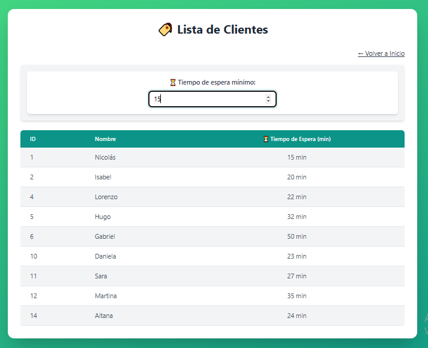

# 📞 Contact Center - Gestión de Clientes y Agentes

**Estado:** 🚀 En desarrollo | ✅ Completo 

 

Este proyecto es una aplicación web desarrollada con **Next.js** y **TailwindCSS** que permite gestionar clientes y agentes de un centro de contacto. Se basa en un backend mockeado con **Node.js**.

## 🖥️ **Tecnologías Utilizadas**  

🔹 **Next.js** – Framework React para SSR y SSG.  
🔹 **React (Hooks & Context API)** – Manejo de estado eficiente.  
🔹 **Tailwind CSS** – Estilos modernos y responsivos.  
🔹 **Next.js Navigation** – Gestión de rutas y filtros dinámicos.  
🔹 **ESLint & Prettier** – Código limpio y formateado. 

## 📷 **Capturas de Pantalla**  

### 🎛️ **Lista de Agentes**  
  

### 🎛️ **Lista de Agentes con Filtro**  
  

### 🎛️ **Lista de Clientes**  
  

### ⏳ **Lista de Clientes Filtrados**  
  

## 🚀 Instalación y Configuración

Sigue estos pasos para instalar y ejecutar el proyecto:

### 1️⃣ Clonar el Repositorio
```bash
git clone https://github.com/cysorianop/contact-center-app.git
cd contact-center-app
```

### 2️⃣ Instalar Dependencias
```bash
npm install
```

### 3️⃣ Iniciar el Servidor Mockeado
Antes de ejecutar la aplicación, inicia el backend simulado:
```bash
node server.js
```

### 4️⃣ Iniciar la Aplicación
```bash
npm run dev
```

La aplicación estará disponible en `http://localhost:3000`.

---

## 📂 Estructura del Proyecto

La organización del código sigue la filosofía de **modularidad y separación de responsabilidades**:

```
app/
 ├── agents/                 # Página y componentes de Agentes
 ├── customers/              # Página y componentes de Clientes
 ├── components/             # Componentes reutilizables
 │   ├── AgentFilter.tsx     # Filtro de búsqueda para Agentes
 │   ├── AgentTable.js       # Tabla de Agentes
 │   ├── CustomerFilter.tsx  # Filtro de búsqueda para Clientes
 │   ├── CustomerTable.js    # Tabla de Clientes
 │   ├── BackToHome.tsx      # Botón para volver a la Home
 ├── context/                # Contexto global para datos compartidos
 │   ├── DataContext.tsx     # Context API para clientes y agentes
 ├── styles/                 # Archivos de estilos (Tailwind, CSS global)
 ├── public/                 # Archivos estáticos como íconos
 ├── services/               # Servicios para manejar datos (fetch, API calls)
 ├── server.js               # Servidor mockeado con Node.js
 ├── README.md               # Documentación del proyecto
 ├── tailwind.config.js       # Configuración de TailwindCSS
 ├── next.config.mjs         # Configuración de Next.js
 ├── package.json            # Dependencias y scripts del proyecto
```

### 📌 **Justificación de la Estructura**
- **Separación por funcionalidades:** Se organizan los módulos en carpetas (`agents`, `customers`) según su dominio.
- **Uso de Context API:** `DataContext.tsx` centraliza los datos para evitar props drilling y mejorar la gestión de estados.
- **Componentes reutilizables:** Elementos como `AgentTable`, `CustomerTable` y `BackToHome` facilitan la reutilización del código.
- **Servidor Mockeado:** `server.js` actúa como backend de prueba para no depender de una API externa.
- **Estilos centralizados:** Uso de `styles/` y configuración en `tailwind.config.js` para mantener el diseño coherente.

---

## 🎯 Funcionalidades Principales
✅ Filtrado de clientes y agentes según criterios específicos.
✅ Visualización dinámica de listas con tiempos de espera.
✅ Interfaz responsiva con diseño moderno en TailwindCSS.
✅ Backend mockeado con datos simulados.

---

## 🎯 **Mejoras Futuras**  

🚀 **WebSockets** para actualización en tiempo real de agentes.  
📊 **Gráficos interactivos** para estadísticas en tiempo real.  
🔗 **Integración con Firebase o una API externa** para datos dinámicos.  

## 📜 Licencia
Este proyecto está bajo la licencia **MIT**. ¡Siéntete libre de contribuir y mejorar la aplicación! 🚀